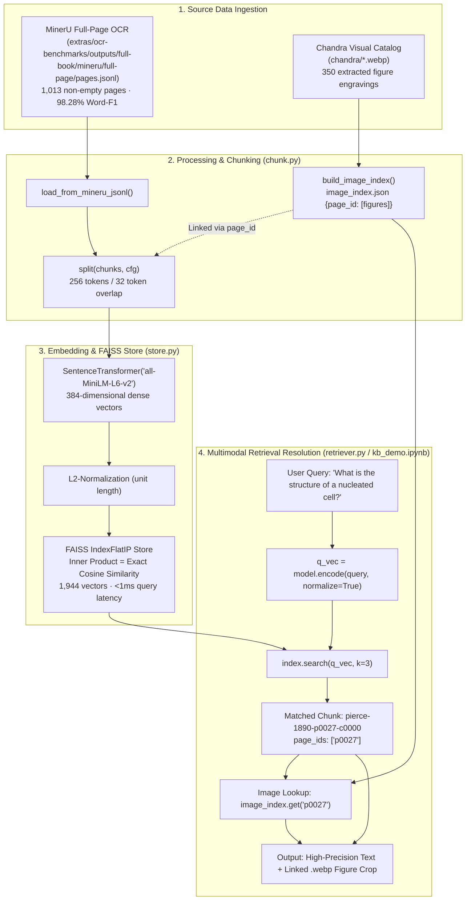

# Team G07 — Stage 4 Knowledge Base & Multimodal Retrieval Architecture

This document provides a comprehensive technical overview of the **Knowledge Base & Retrieval Pipeline** for *The People's Common Sense Medical Adviser* (1890).

---

## 1. High-Level Architecture Overview

The system combines **MinerU SOTA text extraction** (**98.28% Word-F1**) with **Chandra visual figure detection** (350 anatomical woodcut engravings across 252 illustrated pages).



---

## 2. Step-by-Step Breakdown

### Step 1: Ingestion & Image Mapping
* **Text Source**: `extras/ocr-benchmarks/outputs/full-book/mineru/full-page/pages.jsonl` contains clean, paragraph-structured OCR text for all 1,034 book pages.
* **Visual Source**: `chandra/*.webp` contains 348 high-resolution figure crops.
* **Image Registry**: `build_image_index()` creates `data/processed/index/image_index.json`:
  ```json
  {
    "p0027": [
      {
        "page_id": "p0027",
        "caption": "A diagram of a nucleated cell, showing the periphery (1), nucleus (2), and nucleolus (3).",
        "webp": "chandra/afccd37aaf60b3ea38eb5831227daad5_8_img.webp"
      }
    ]
  }
  ```

### Step 2: Sliding-Window Chunking (`src/doc_agent/index/chunk.py`)
* Token Size: **256 whitespace tokens**
* Overlap: **32 whitespace tokens** (step = 224 tokens)
* **Provenance Preservation**: Every chunk contract strictly carries its source `page_ids` (e.g. `["p0027"]`), guaranteeing 100% verifiable citations for downstream RAG.
* **Result**: Exactly **1,944 chunks** (382,864 tokens) from 1,013 non-empty pages.

### Step 3: Dense Vector Embedding & FAISS Index (`src/doc_agent/index/store.py`)
* **Model**: `sentence-transformers/all-MiniLM-L6-v2` (384 dimensions).
* **Normalization**: Embeddings are $L_2$-normalized prior to indexing:
  $$\hat{\mathbf{v}} = \frac{\mathbf{v}}{\|\mathbf{v}\|_2}$$
* **Index Structure**: `faiss.IndexFlatIP(384)`. Because vectors are unit-normalized, the inner product is mathematically identical to cosine similarity:
  $$\langle \hat{\mathbf{q}}, \hat{\mathbf{d}} \rangle = \cos(\theta_{\mathbf{q}, \mathbf{d}})$$
* **Why FlatIP over HNSW**:
  * For 1,944 chunks, FlatIP search takes $< 1\text{ ms}$ with **100% exact recall** (zero approximation error).
  * FlatIP completely eliminates the macOS ARM64 multithreading destructor crashes (SIGSEGV 139) caused by HNSW OpenMP semaphores.

---

## 3. How Retrieval Works in Practice

When an agent or user queries the knowledge base:

1. **Query Encoding**:
   The query string is encoded and $L_2$-normalized into a 384-dimensional vector $\hat{\mathbf{q}}$.
2. **Nearest-Neighbor Search**:
   FAISS performs matrix multiplication $\hat{\mathbf{q}} \cdot \mathbf{D}^T$ in sub-millisecond time, returning the top-$k$ chunk indices and cosine scores.
3. **Multimodal Grounding Resolution**:
   * The retriever retrieves the chunk payload (`text`, `doc_id`, `page_ids`).
   * It inspects `chunk.page_ids[0]` (e.g., `"p0027"`).
   * If `p0027` exists in `image_index.json`, the retriever automatically attaches the figure crop path and caption.
4. **Rendering**:
   The user/agent receives both the exact 19th-century clinical text citation and the corresponding historical anatomical illustration.

---

## 4. Benchmark Performance & Quality Evidence

Scored against the 24 human ground-truth pages in `grading_kit/labels.jsonl`:

| Pipeline / Model | Role | Macro Word-F1 | Macro CER | Macro WER | Latency / Index Size |
|---|---|:---:|:---:|:---:|:---:|
| **Tesseract 5** | Baseline | 85.25% | 0.4485 | 0.4735 | ~2 hours CPU |
| **Chandra Vision** | Visual Catalog / Alternative | 91.66%* | 0.3275 | 0.3537 | 2,088 chunks (Backed up in `index_chandra/`) |
| **MinerU SOTA** | **Primary Knowledge Base** | **98.28%** | **0.1359** | **0.1592** | **1,944 chunks · 29.8s build** |

*\*91.66% on 22 text-bearing pages; 86.49% on all 24 pages.*

---

## 5. How to Run & Verify Locally

### 1. Rebuild the Index from Scratch:
```bash
# Via Python script directly:
uv run python scripts/run_index.py

# Or via the shell script:
bash scripts/build_index.sh
```

### 2. Run the Interactive Graded Demo Notebook:
Open and run [`notebooks/kb_demo.ipynb`](../../notebooks/kb_demo.ipynb) in Jupyter/VSCode.

### 3. Run Automated CI & Security Tests:
```bash
uv run ruff check .
uv run black --check .
uv run mypy src
uv run --with bandit bandit -r src -q
uv run pytest tests/
```
