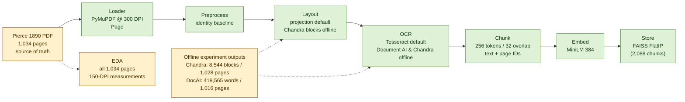

# Knowledge-base pipeline diagram

This map shows the fixed A2 stage order and separates implemented adapters from
real experiment outputs and pending evidence. The full corpus is not claimed
to have completed the index or retrieval stages.

## Current status

- **Real source and offline outputs:** the Pierce PDF has 1,034 pages; the
  150-DPI EDA ran over all pages. The Chandra reference contains 8,544 blocks
  on 1,028 pages; Document AI reference OCR contains 419,565 words on 1,016
  word-bearing pages.
- **Implemented adapters:** PyMuPDF 300-DPI rendering, identity preprocessing,
  projection layout, Chandra parser (`load_from_pages_markdown`), figure extraction (`build_image_index`),
  sliding-window 256/32 chunking, SentenceTransformer `all-MiniLM-L6-v2` (384-d) dense embedding,
  and FAISS `IndexFlatIP` vector store with metadata and image indexing.
- **Index status:** The Stage 4 index is fully built under `data/processed/index/`
  with 2,088 chunks, 384 embedding dimensions, and 350 figure references across 252 illustrated pages.
- **Scope rule:** no live web search is part of the retrieval pipeline; answers
  remain strictly grounded in the declared Pierce source.

## Contract path

`Page -> Region -> OCR text -> Chunk -> embedding -> vector store` (Tesseract
default; optional offline reference).
Page IDs survive into each fixed `Chunk`, so a later agent can cite the scanned
page. Coordinates are used at the layout/OCR seam but do not survive in the fixed
`Chunk` contract.
