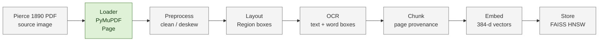

# Knowledge-base pipeline diagram

This is the A2 design map. The boxes show the fixed stage order; implementation
and evidence status are listed below. The diagram is not a claim that the full
corpus has already run.

## Current status

- **Baseline code present:** the loader, identity preprocessing, projection
  layout, Tesseract OCR adapter, chunker, lazy embedder, FAISS store, and
  `scripts/build_index.sh` now edit the named A2 stubs.
- **Measured research:** figure-detector comparisons, an OCR bake-off harness,
  and a paid Document OCR sweep exist under the private development workspace.
  They are evidence for decisions only; detector votes and provider confidence
  are not project accuracy metrics.
- **Pending evidence:** a hand-labelled OCR score, full-corpus index statistics,
  and one real retrieval from `kb_demo.ipynb`. The local environment currently
  lacks the FAISS package and the embedding checkpoint, so no index result is
  claimed here.
- **Evidence rule:** the A2 form may report an OCR score or retrieval example
  only after a hand-labelled sample and a reproducible notebook output exist.
- **Scope rule:** no live web search is part of the retrieval pipeline. The
  source is the declared corpus, and paid/cloud experiments remain baselines or
  research notes rather than query-time dependencies.

## Contract path

`Page -> Region -> OCR text and word geometry -> Chunk -> embedding -> vector
store`. Page IDs and source coordinates must survive every boundary so a later
agent can cite the scanned page and a human can verify it quickly.
