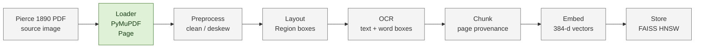

# Knowledge-base pipeline diagram

This is the A2 design map. A green box is implemented in the current starter;
the other boxes are the next knowledge-base increments. The diagram is not a
claim that every stage has already run.

## Current status

- **Implemented:** the loader renders the real Pierce PDF one page at a time,
  with deterministic 300-DPI RGB JPEG settings and atomic cache writes.
- **Measured research:** figure-detector comparisons, an OCR bake-off harness,
  and a paid Document OCR sweep exist under the private development workspace.
  They are evidence for decisions only; detector votes and provider confidence
  are not project accuracy metrics.
- **Pending runtime stages:** preprocess, layout adapter, OCR, chunking,
  embeddings, persistent store, `scripts/build_index.sh`, and the real
  `notebooks/kb_demo.ipynb` run.
- **Evidence rule:** the A2 form may report an OCR score or retrieval example
  only after a hand-labelled sample and a reproducible notebook output exist.
- **Scope rule:** no live web search is part of the retrieval pipeline. The
  source is the declared corpus, and paid/cloud experiments remain baselines or
  research notes rather than query-time dependencies.

## Contract path

`Page -> Region -> OCR text and word geometry -> Chunk -> embedding -> vector
store`. Page IDs and source coordinates must survive every boundary so a later
agent can cite the scanned page and a human can verify it quickly.
