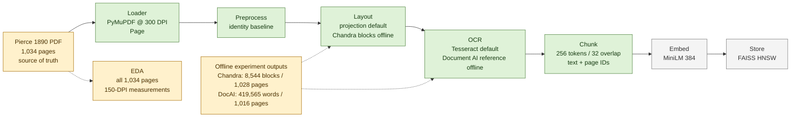

# Knowledge-base pipeline diagram

This map shows the fixed A2 stage order and separates implemented adapters from
real experiment outputs and pending evidence. The full corpus is not claimed
to have completed the index or retrieval stages.

## Current status

- **Real source and offline outputs:** the Pierce PDF has 1,034 pages; the
  150-DPI EDA ran over all pages. The Chandra reference contains 8,544 blocks
  on 1,028 pages; Document AI reference OCR contains 419,565 words on 1,016
  word-bearing pages. Generated layout records are kept in the external
  [Kaggle artifact package](https://www.kaggle.com/datasets/cruelangelssprint/pierce-1890-figure-and-ocr-outputs)
  (version 3); they are not runtime dependencies.
- **Implemented adapters:** PyMuPDF 300-DPI rendering, identity preprocessing,
  projection layout, optional offline Chandra Regions, Tesseract, optional
  Document AI reference mapping, and 256/32 Chunking are implemented. Reference
  assignment covers 417,825/419,565 words; 1,740 words on 36 pages remain outside
  every Chandra Region, so full reference coverage is not claimed.
- **Evidence boundary:** Document AI and Chandra outputs are reference or
  pre-annotation inputs, never ground truth. Word boxes are consumed for Region
  mapping, but fixed `Chunk` keeps text and page IDs only. Hand GT, OCR accuracy,
  full index statistics, and retrieval remain pending.
- **Index status:** MiniLM-384 embedding and FAISS HNSW code exists, but no real
  full-corpus index or retrieval result is claimed.
- **Scope rule:** no live web search is part of the retrieval pipeline; answers
  must remain grounded in the declared Pierce source.

## Contract path

`Page -> Region -> OCR text -> Chunk -> embedding -> vector store` (Tesseract
default; optional offline reference).
Page IDs survive into each fixed `Chunk`, so a later agent can cite the scanned
page. Coordinates are used at the layout/OCR seam but do not survive in the fixed
`Chunk` contract.
